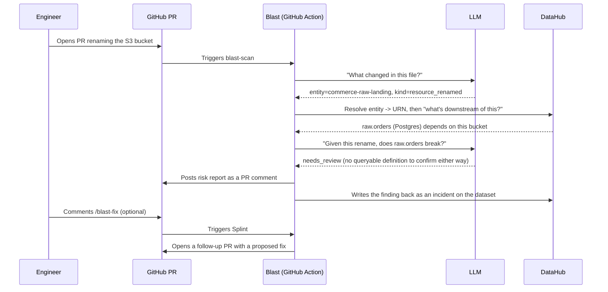

# Blast

**Know what breaks before you merge.**

Blast is a GitHub Action + AI agent that reads a pull request that changes
*any* data asset's definition — a dbt model, raw SQL DDL, a Terraform
resource, or anything else an LLM can read — queries
[DataHub](https://datahubproject.io/) — through its **MCP Server** — for
everything downstream, **simulates whether that downstream code would
actually break**, and posts a risk report as a PR comment before anyone
merges — then writes the finding back into DataHub as an incident, so the
next PR against that table inherits the history. It's not a dbt-only tool:
an LLM interprets the diff and classifies downstream risk generically, so
it works across whatever formats an org's various repos actually use — see
[`docs/architecture.md`](docs/architecture.md).

Comment `/blast-fix` on a reported PR and **Splint**, a second agent, will
generate a corrected version of the broken downstream code and open it as a
follow-up PR for review — turning the warning into an actual fix.

## How it works, with an example

Say an engineer renames an S3 bucket in Terraform — `commerce-raw-landing`
→ `commerce-landing-zone` — and opens a PR. Nothing about that file *looks*
risky; it's an infrastructure rename, not a code change. Here's what
happens next:



Three things worth noticing in that example:

- **No bucket-specific code was written.** The same pipeline handles a
  renamed SQL column, a dropped Kafka topic, or a Terraform resource,
  because step one is always "ask an LLM what this diff means," not "run
  the Terraform parser" or "run the SQL parser."
- **DataHub is the only source of truth for "what's connected."** Blast
  never scans other repos or guesses at dependencies — it asks DataHub's
  lineage graph, which already knows the full picture across every
  ingested platform.
- **`needs_review` is a real, intentional outcome**, not a failure. A raw
  database table has no visible query text to check against, so Blast says
  so plainly instead of guessing — a wrong confident answer is worse than
  an honest "a person should look at this one."

See [`docs/architecture.md`](docs/architecture.md) for the full pipeline
diagrams (blast-scan and Splint), module-by-module design notes, and known
limitations.

## Quickstart — run the bundled demo (no infra required)

This reproduces `examples/sample_pr_comment.md` exactly, using a mock
DataHub lineage fixture and a mock (network-free) LLM summarizer:

```bash
pip install -r requirements.txt
python agents/blast-scan/main.py --demo
```

That's it — no Docker, no OpenAI key, no GitHub token needed. The demo diffs
`examples/demo_dbt_project` (baseline) against `examples/demo_pr_change`
(proposed PR) for a renamed + retyped column in `stg_orders`, and prints the
full PR comment — findings table, Mermaid dependency graph, incident-history
line, and summary — to stdout. See
`examples/demo_pr_change/CHANGE_SCENARIO.md` for the exact change and the
expected classification for each downstream model.

## Running against a real DataHub instance + real PR

1. **Start DataHub locally** (needs Docker Desktop, 8GB+ RAM allocated):

   ```bash
   python3 -m pip install --upgrade pip wheel setuptools
   python3 -m pip install --upgrade acryl-datahub
   datahub docker quickstart
   datahub init
   datahub datapack load showcase-ecommerce   # or ingest your own dbt project's manifest
   ```

   UI at http://localhost:9002 (login `datahub`/`datahub`). Generate a
   personal access token under **Settings → Access Tokens**.

2. **Copy `.env.example` to `.env`** and fill in `OPENAI_API_KEY`,
   `DATAHUB_SERVER`, `DATAHUB_TOKEN`. Set `BLAST_MOCK_DATAHUB=0` and
   `BLAST_MOCK_LLM=0` to use the real services. Lineage reads try DataHub's
   MCP Server first and fall back to GraphQL automatically
   (`BLAST_DATAHUB_MODE=auto`) — see `docs/architecture.md`'s known
   limitations for what's verified vs. not about that path.

3. **Install dependencies**: `pip install -r requirements.txt`

4. **Adopt the reusable workflows in your own repo** — no vendored Python,
   just two 5-line wrapper files. Copy
   `examples/consumer-workflows/blast-scan.yml` and
   (optionally) `examples/consumer-workflows/blast-fix.yml` into your repo's
   `.github/workflows/`, then add `OPENAI_API_KEY`, `DATAHUB_SERVER`,
   `DATAHUB_TOKEN` as [repository secrets](https://docs.github.com/en/actions/security-guides/using-secrets-in-github-actions).
   This only works once Blast itself is pushed to a real GitHub remote that
   `uses:` can point at.

5. Open a PR against your dbt project that changes a model or its
   `schema.yml` — Blast comments automatically. Comment `/blast-fix` on it
   to have Splint propose a fix.

## Repo layout

```
blast/
├── LICENSE                       # Apache 2.0
├── agents/
│   ├── _common/                  # shared by both agents: change interpretation,
│   │                              # entity resolution, DataHub client, breakage classification
│   ├── blast-scan/                # reads a PR, reports risk
│   └── splint/                    # /blast-fix: proposes a fix as a follow-up PR
├── .github/workflows/
│   ├── blast-scan.yml             # reusable workflow, called from any repo
│   └── blast-fix.yml              # reusable workflow, triggers Splint
├── examples/
│   ├── sample_pr_comment.md       # real output from `python agents/blast-scan/main.py --demo`
│   ├── demo_dbt_project/          # baseline demo dbt project + mock lineage fixture
│   ├── demo_pr_change/            # proposed PR version of the changed files
│   └── consumer-workflows/        # copy-paste wrapper workflows for adopting repos
└── docs/architecture.md
```

## Tech stack

DataHub Core (self-hosted, Apache 2.0) · DataHub MCP Server (lineage reads,
with a GraphQL fallback) · Python · sqlglot · OpenAI `gpt-4o-mini` ·
GitHub Actions (reusable workflows) · Mermaid · PyGithub.

Runs on infrastructure that costs nothing to operate: DataHub Core is free
and self-hosted, GitHub Actions is free on public repos, and the only paid
API (OpenAI) uses a small, cheap model and is fully mockable during
development (`BLAST_MOCK_LLM=1`).

## License

Apache 2.0 — see [`LICENSE`](LICENSE).
