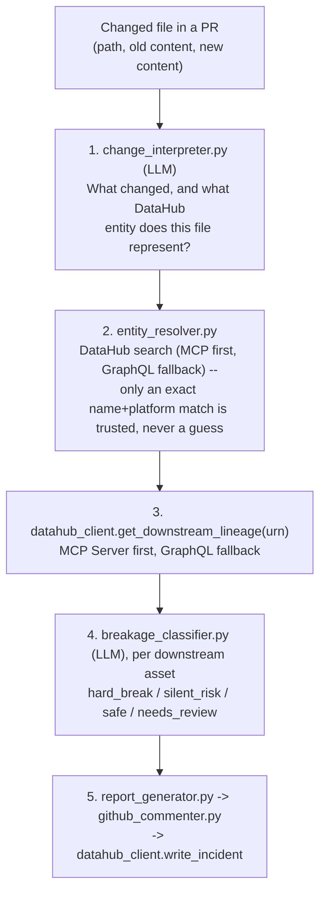
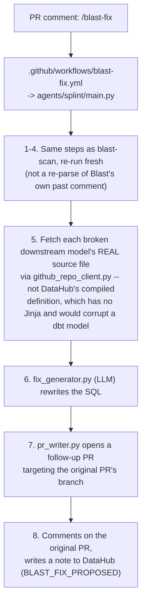

# Blast Architecture

Two agents, sharing one library, built around one idea: **don't hand-write
a parser per file format.** An earlier version of Blast only understood
dbt-model-shaped SQL (via sqlglot). That doesn't scale to "works across an
entire org" -- the next team's Terraform, Tableau config, or Airflow DAG
would each need a new detector, forever one step behind whatever the org
actually uses. Instead, an LLM reads the raw diff and describes what
changed, for any format it can already read (which is most of them).

```
agents/
├── _common/                    # shared by both agents
│   ├── change_interpreter.py   # LLM: "what changed, and what DataHub entity is this?"
│   ├── entity_resolver.py      # name+platform -> DataHub URN via search (MCP-first, GraphQL fallback)
│   ├── datahub_client.py       # lineage reads (MCP-first, GraphQL fallback), incident read/write
│   ├── mcp_datahub_client.py   # real DataHub MCP Server client: lineage + search
│   ├── breakage_classifier.py  # LLM: does this downstream asset actually break?
│   ├── github_repo_client.py   # branch / commit / PR helpers (Splint only)
│   ├── diff_parser.py          # sqlglot/YAML diffing -- now only the mock backend, see below
│   ├── impact_simulator.py     # AST column-reference scan -- now only the mock backend, see below
│   └── sql_utils.py
├── blast-scan/                  # reads a PR, reports risk
│   ├── main.py
│   ├── report_generator.py     # OpenAI summary (gpt-4o-mini)
│   ├── graph_renderer.py       # Mermaid generation
│   └── github_commenter.py     # posts PR comment
└── splint/                      # /blast-fix: proposes a fix as a follow-up PR
    ├── main.py
    ├── fix_generator.py         # OpenAI SQL fix (gpt-4o-mini)
    └── pr_writer.py
```

## Pipeline (per changed file, any format)



`agents/blast-scan/main.py` runs this for every changed file in a PR (a
cheap extension-based denylist skips obviously-irrelevant files like images
or lockfiles before even calling the LLM -- not a format allowlist).
Files change_interpreter finds nothing schema-relevant in are skipped
silently, not treated as errors -- this is what makes the scan behave like
a whole-repo static-analysis tool instead of a narrow dbt-only one.

## Splint pipeline (`/blast-fix`)



## Module responsibilities

- **`change_interpreter.py`** — one LLM call per changed file, returns the
  entity name/platform/schema this file represents plus a normalized list
  of changes (`renamed`/`dropped`/`added`/`type_changed` for a column or
  field within an asset; `resource_renamed`/`resource_deleted` for the
  whole asset's identity changing, e.g. an S3 bucket or Kafka topic
  renamed). This is the module that makes Blast format-agnostic: no SQL
  parser, no HCL parser, no Tableau parser needed.

- **`entity_resolver.py`** — resolves that name/platform to a DataHub URN
  purely via `datahub_client.search_entity()` (MCP first, GraphQL fallback)
  -- no per-repo config file to maintain, so any repo works the same way
  with zero setup. Only trusted on an exact name+platform match; never
  silently guesses. Skips the file (logged) rather than resolving to the
  wrong entity.

- **`datahub_client.py` / `mcp_datahub_client.py`** — lineage reads try
  DataHub's **MCP Server** first (the preferred, DataHub-native
  integration surface), using the real `mcp` Python SDK with dynamic tool discovery
  (finds a tool by name pattern rather than assuming one exact name),
  falling back automatically to hand-rolled GraphQL if MCP is unavailable
  or its result can't be confidently parsed. `search_entities_via_mcp()`
  does the same for entity resolution's fallback path.
  `count_recent_incidents()` / `write_incident()` are the proven,
  live-tested write-back mechanism -- see "Known limitations" for what's
  verified vs. not about the MCP half specifically.

- **`breakage_classifier.py`** — one LLM call per downstream asset, given
  the upstream changes and whatever DataHub knows about that asset's
  definition (SQL, or a description, or nothing). `needs_review` is the
  honest degrade when there's nothing to reason from, instead of guessing
  -- this is what makes classification format-agnostic too: it doesn't
  need the downstream thing to be SQL, just readable.

- **`diff_parser.py` / `impact_simulator.py`** — the *original* Blast
  pipeline (sqlglot AST diffing and column-reference scanning). These are
  no longer the production path -- they're now only the internals of the
  mock (`BLAST_MOCK_LLM=1`) backends of `change_interpreter.py` and
  `breakage_classifier.py`, kept because they're proven, free, and
  deterministic, which is exactly what a mock/offline path should be. They
  only understand dbt-model-shaped SQL and schema.yml; that's enough to
  replay the bundled demo without network calls, not a general parser.

- **`report_generator.py`**, **`graph_renderer.py`**, **`github_commenter.py`**
  — unchanged in spirit from the original design: provider-agnostic
  summary generation, color-coded Mermaid rendering, comment
  posting/editing via a hidden marker. `github_commenter.py` now also
  surfaces the incident-history count and, when `DownstreamAsset.owners`
  is populated, names the owning team/user in plain text (not a live
  GitHub `@mention` -- a DataHub owner identifier isn't guaranteed to be a
  valid GitHub handle).

- **`fix_generator.py`**, **`pr_writer.py`** (Splint only) — same
  pluggable-provider pattern; `pr_writer.py` locates each broken model's
  source file by the `models/**/{name}.sql` naming convention (DataHub's
  lineage doesn't expose source file paths) and opens the follow-up PR.

## DataHub Skills vs. the MCP Server -- what Blast actually uses

DataHub publishes both an **MCP Server** (discrete callable tools: search,
lineage, enrich, quality, setup) and **Skills**
(docs.datahub.com/docs/dev-guides/agent-context/skills) -- slash-commands
(`/datahub-skills:datahub-lineage`, etc.) installed as plugins into
*interactive* agent CLIs (Claude Code, Cursor, GitHub Copilot, Codex,
Gemini CLI, Windsurf) via `npx skills add datahub-project/datahub-skills`.
Skills are explicitly *instructions* for chaining MCP tools into workflows;
the MCP Server provides the tools themselves.

Blast is a headless script running in GitHub Actions, not an interactive
agent session -- it can't invoke a Skill. What it does instead is
implement the same *kind* of workflow each relevant Skill describes,
natively, against the MCP Server's tools directly:

| Skill | Blast's equivalent |
|---|---|
| `datahub-search` | `entity_resolver.py` / `datahub_client.search_entity()` |
| `datahub-lineage` | `datahub_client.get_downstream_lineage()` |
| `datahub-quality` | `count_recent_incidents()` / `write_incident()` (Incidents, today) |
| `datahub-enrich` | not implemented -- structured properties/tags would be the more idiomatic write-back target than raw Incidents; roadmap |
| `datahub-setup` | not applicable (interactive auth configuration) |

A developer reviewing a Splint fix PR could separately run
`/datahub-skills:datahub-lineage` themselves in their own Claude
Code/Cursor session to explore the graph interactively -- a genuinely
useful complementary tool, just not something Blast's pipeline depends on.

## Known limitations (by design, for this stage of the project)

- **MCP path is unverified against a live server.** `mcp_datahub_client.py`
  is a genuine, protocol-correct MCP client (real `mcp` SDK, dynamic tool
  discovery), but this environment doesn't have a confirmed DataHub MCP
  server binary to test it against end-to-end. The GraphQL fallback path
  is what's actually verified (tested live against a running DataHub
  instance, including a real schema-mismatch bug found and fixed via
  introspection). Run with `BLAST_DATAHUB_MODE=mcp` to confirm your
  specific server/tool names work, rather than relying on `auto` to
  silently fall back.
- **`datahub-enrich`/structured-property write-back isn't implemented** --
  see the Skills table above. Today's write-back is DataHub Incidents,
  which is proven live; a "risk score" as a structured property is a
  documented next step, not a claim made now.
- **Entity resolution depends entirely on a confident DataHub search
  match.** If the LLM's guessed name/platform doesn't cleanly match
  anything in DataHub (a genuinely ambiguous name, or an entity DataHub
  hasn't ingested), Blast skips the file (logged) rather than resolving to
  the wrong entity. This is intentional -- a wrong URN produces a
  confidently-wrong report, which is worse than no report. There's no
  per-repo config file to fall back on anymore, which means the org's
  DataHub instance genuinely needs to have ingested whatever's being
  changed for Blast to say anything about it.
- **S3 is a harder case than table-shaped platforms**: DataHub's `s3`
  source creates one dataset per file-group *within* a bucket, not one
  dataset for the bucket itself, so a bucket *rename* doesn't cleanly
  resolve to a single URN by name alone -- search would need to be paired
  with knowing which of the bucket's per-file datasets are actually
  affected, which isn't implemented.
- **Splint locates source files by naming convention**
  (`models/**/{name}.sql`), since DataHub's lineage graph doesn't expose a
  downstream asset's source file path.
- **Splint on fork PRs**: comment-triggered workflows get a read-only
  `GITHUB_TOKEN` when the triggering PR is from a fork -- a GitHub platform
  restriction, not something `blast-fix.yml` can route around.
- Classification (via the LLM) is only as good as the definition DataHub
  has on file for a downstream asset. An asset with no description/SQL/
  properties gets `needs_review`, honestly, rather than a guessed verdict.
