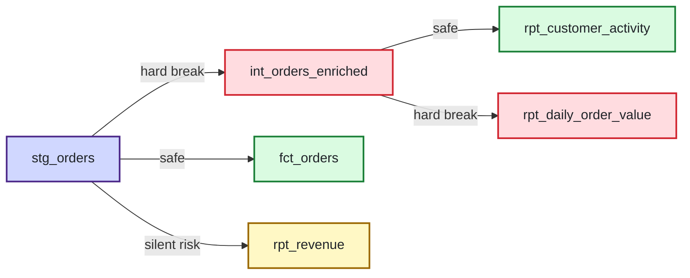

<!--
This is real output from `python agents/blast-scan/main.py --demo`
(BLAST_MOCK_DATAHUB=1, BLAST_MOCK_LLM=1), run against
examples/demo_dbt_project vs examples/demo_pr_change. See
examples/demo_pr_change/CHANGE_SCENARIO.md for the change that produced it.
-->

<!-- blast-report:stg_orders -->
### 🧨 **Blast** found 2 breaking changes and 1 silent risk downstream in `stg_orders`

Changing `stg_orders` (renamed `order_total` -> `total_amount`, changed `order_total_tax numeric(10,2)` -> `order_total_tax integer`) affects 5 downstream model(s). 2 will break outright: int_orders_enriched, rpt_daily_order_value. 1 carry silent risk: rpt_revenue.

📜 **Institutional memory:** `stg_orders` has been flagged for 3 predicted breaking changes in the last 90 days (risk score: 100/100) -- this isn't a one-off. (Flagged pre-merge, not confirmed shipped breakage.)

👤 **Owners to loop in:** `int_orders_enriched` (data-eng), `rpt_revenue` (finance-analytics), `rpt_daily_order_value` (ops-analytics)

#### Downstream impact

| | Model | Hops | Verdict |
|---|---|---|---|
| 🔴 | `int_orders_enriched` | 1 | hard break |
| 🔴 | `rpt_daily_order_value` | 2 | hard break |
| 🟡 | `rpt_revenue` | 1 | silent risk |
| 🟢 | `fct_orders` | 1 | safe |
| 🟢 | `rpt_customer_activity` | 2 | safe |

#### Details

- 🔴 **`int_orders_enriched`**
  - references `order_total`, which was renamed to `total_amount` upstream and no longer exists.
  - selects `order_total_tax`, whose type is changing from numeric(10,2) to integer -- downstream consumers may see different formatting/precision.
- 🟡 **`rpt_revenue`**
  - aggregates/computes over `order_total_tax`, whose type is changing from numeric(10,2) to integer -- may silently change results (e.g. precision loss) without erroring.
- 🔴 **`rpt_daily_order_value`**
  - references `order_total`, which was renamed to `total_amount` upstream and no longer exists.

#### Dependency graph

_Findings written back to DataHub as an incident on the changed dataset. Comment `/blast-fix` on this PR to have **Splint** propose a fix as a follow-up PR._
